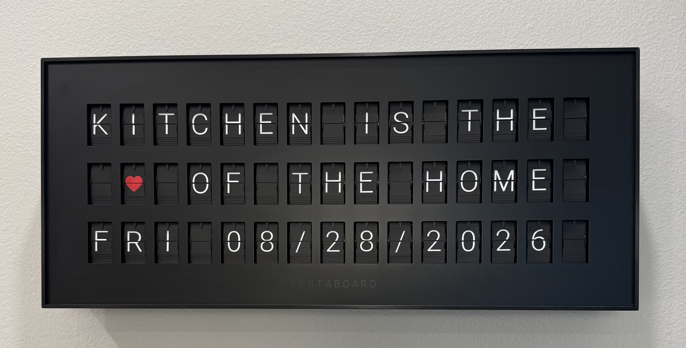
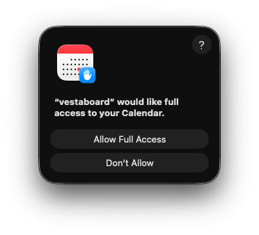

# Vestaboard Smart Home Display

[](https://github.com/ankurp/vestaboard-note-smart-display/actions/workflows/ci.yml)
[](LICENSE)

A self-updating [Vestaboard Note](https://www.vestaboard.com/) display for the kitchen. A single Swift process decides what to show based on the time of day and your calendar — no manual switching required.

- **Upcoming events** — when a calendar event starts within the next hour, the board shows the start time and an AI-shortened event name.
- **Morning weather** — between 7–8 AM, the board shows your local temperature and conditions.
- **Idle / default** — the rest of the day it shows a friendly message with the weekday and date.

## Demo



```
   KITCHEN IS THE
   ♥ OF THE HOME
   THU 08/28/2026
```

## How it works

The `vestaboard` executable runs a one-minute loop that selects a board by priority:

| Priority | Mode    | Condition                                      | Shows                              |
| -------- | ------- | ---------------------------------------------- | ---------------------------------- |
| 1        | Event   | A calendar event starts within the next 60 min | Start time + shortened event name  |
| 2        | Weather | Local time is between 7:00 and 8:00 AM         | City, temperature, conditions      |
| 3        | Default | Otherwise                                      | Kitchen message + weekday and date |

The board is only pushed when the layout actually changes, so the Vestaboard API is never spammed.

Native macOS integration is built directly into the executable:

- **EventKit** reads upcoming events from the macOS Calendar.
- **Foundation Models** uses Apple's on-device model to shorten event names to the 9-character display (e.g. `"Om Taekwondo"` → `TAEKWONDO`). If the model is unavailable, it falls back to truncation.

## Requirements

- macOS 15+ (Sequoia or later) — required for EventKit full access. Event summarization additionally requires Apple Foundation Models (macOS 26+ on Apple Silicon); without it, names fall back to truncation.
- Xcode command line tools (`swift`, `codesign`) — to build and sign the executable.
- A Vestaboard with a [Cloud API token](https://docs.vestaboard.com/).

## Setup

1. **Clone the repository:**

   ```sh
   git clone https://github.com/ankurp/vestaboard-note-smart-display.git
   cd vestaboard-note-smart-display
   ```

2. **Configure environment variables:**

   ```sh
   cp .env.example .env
   ```

   Edit `.env`:

   | Variable           | Required | Description                                                              |
   | ------------------ | -------- | ------------------------------------------------------------------------ |
   | `VESTABOARD_TOKEN` | Yes      | Vestaboard Cloud API token (Settings in the mobile app or web app).      |
   | `ZIP_CODE`         | No\*     | US ZIP code used for the weather location.                               |
   | `CITY`             | No\*     | City name used for the weather location (alternative to `ZIP_CODE`).     |
   | `CALENDAR_NAME`    | No       | Calendar name(s) to read events from. Comma-separated. Default `Family`. |

   \*If neither `ZIP_CODE` nor `CITY` is set, weather mode is skipped and the default display is shown instead.

3. **Build and code-sign the executable:**

   ```sh
   ./Scripts/build.sh
   ```

   This compiles the release binary and code-signs it with the Calendar entitlement (from `entitlements.plist`) so it can read events via EventKit.

4. **Grant Calendar access.** The first time `get-events` runs, macOS prompts for Calendar access. Approve it (or enable it under **System Settings → Privacy & Security → Calendars**).

   > **Note:** macOS grants Calendar access _per host application_, not per script. The permission belongs to whichever app launches the board — Terminal, VS Code, or `launchd`. If you run it from a different app than the one you first approved, you must grant Calendar access to that app too (and fully quit and reopen it) or you'll see `No matching calendars found`.

   

## Usage

Run the display:

```sh
swift run vestaboard
```

Or run the signed release binary directly (recommended, so Calendar access works reliably):

```sh
./Scripts/build.sh
.build/release/vestaboard
```

The process updates the board immediately, then re-evaluates every minute. Press `Ctrl+C` to stop.

### Run continuously

To keep the display running in the background and start it at login, install the
bundled `launchd` agent:

```sh
./launchd/install.sh
```

This builds and signs the release binary, writes a per-user LaunchAgent, and
starts it. To stop and remove it:

```sh
./launchd/uninstall.sh
```

## Configuration

Behavior is tuned via constants in [`Sources/VestaboardCore/Config.swift`](Sources/VestaboardCore/Config.swift):

| Constant               | Default  | Description                                             |
| ---------------------- | -------- | ------------------------------------------------------- |
| `EVENT_WINDOW_MINUTES` | `60`     | How soon an event must start to take over the board.    |
| `WEATHER_HOUR_START`   | `7`      | Hour (24h) when the weather window begins.              |
| `WEATHER_HOUR_END`     | `8`      | Hour (24h) when the weather window ends.                |
| `WEATHER_CACHE_MS`     | `30 min` | How long fetched weather stays fresh before refetching. |
| `UPDATE_INTERVAL_MS`   | `60 s`   | How often the board is re-evaluated.                    |

## Project structure

```
Package.swift              Swift package manifest
Sources/
  VestaboardCore/          Platform-independent, unit-tested logic
    Config.swift           Environment configuration and behavior constants
    DotEnv.swift           Minimal .env file loader
    Display.swift          Character encoding, row helpers, Vestaboard API client
    Clock.swift            Default idle board (message + weekday/date)
    Weather.swift          Weather board (Open-Meteo, with caching)
    CalendarBoard.swift    Event parsing, selection, and board rendering
    Models.swift           Shared value types (Board, CalendarEvent)
  vestaboard/              The macOS executable
    App.swift              Main loop — selects and pushes a board each minute
    EventKitProvider.swift EventKit reader (upcoming calendar events)
    Summarizer.swift       Foundation Models event-name shortener
Tests/
  VestaboardCoreTests/     Unit tests for the core logic
entitlements.plist         Calendar entitlement for the signed binary
Scripts/build.sh           Builds and code-signs the release binary
```

## Data sources

- **Weather** — [Open-Meteo](https://open-meteo.com/) (free, no API key required).
- **Calendar** — macOS Calendar via [EventKit](https://developer.apple.com/documentation/eventkit).
- **Event summaries** — Apple [Foundation Models](https://developer.apple.com/documentation/foundationmodels) (on-device).

## Development

The platform-independent logic lives in `Sources/VestaboardCore/` and is covered
by unit tests that run anywhere (no Vestaboard required).

```sh
swift build         # build the package
swift test          # run the test suite
swift run vestaboard # run the display
```

Continuous integration builds and tests the package on macOS on every push and
pull request (see [`.github/workflows/ci.yml`](.github/workflows/ci.yml)).

See [CONTRIBUTING.md](CONTRIBUTING.md) for the full workflow.

## Troubleshooting

- **`Calendar access denied`** — grant access under System Settings → Privacy & Security → Calendars, then rerun.
- **`No matching calendars found` (works in one app but not another)** — Calendar access is granted _per host application_. If it works from Terminal but not from VS Code (or vice versa), grant Calendar access to that specific app under **System Settings → Privacy & Security → Calendars**, then fully quit and reopen it (a window reload isn't enough).
- **`No matching calendars found`** — also ensure `CALENDAR_NAME` exactly matches a calendar title in the Calendar app.
- **Weather not showing at 7 AM** — confirm `ZIP_CODE` or `CITY` is set and that the location resolves.
- **Event names truncated instead of summarized** — the Foundation Models runtime may be unavailable; the helper falls back to truncation automatically.

## License

MIT
